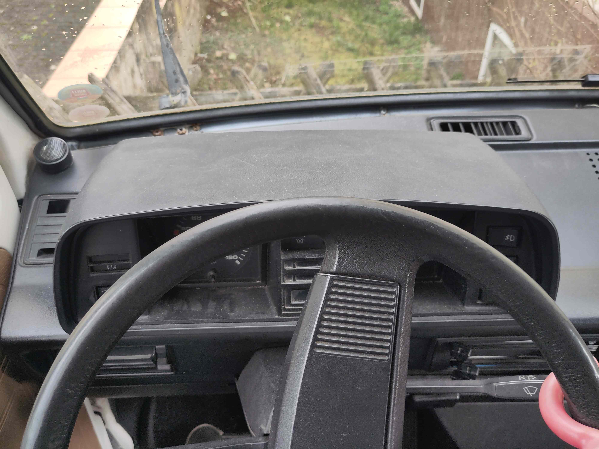
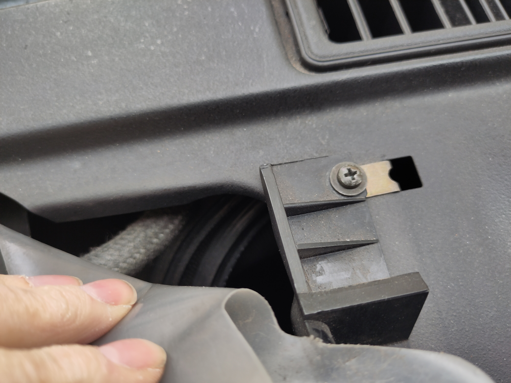
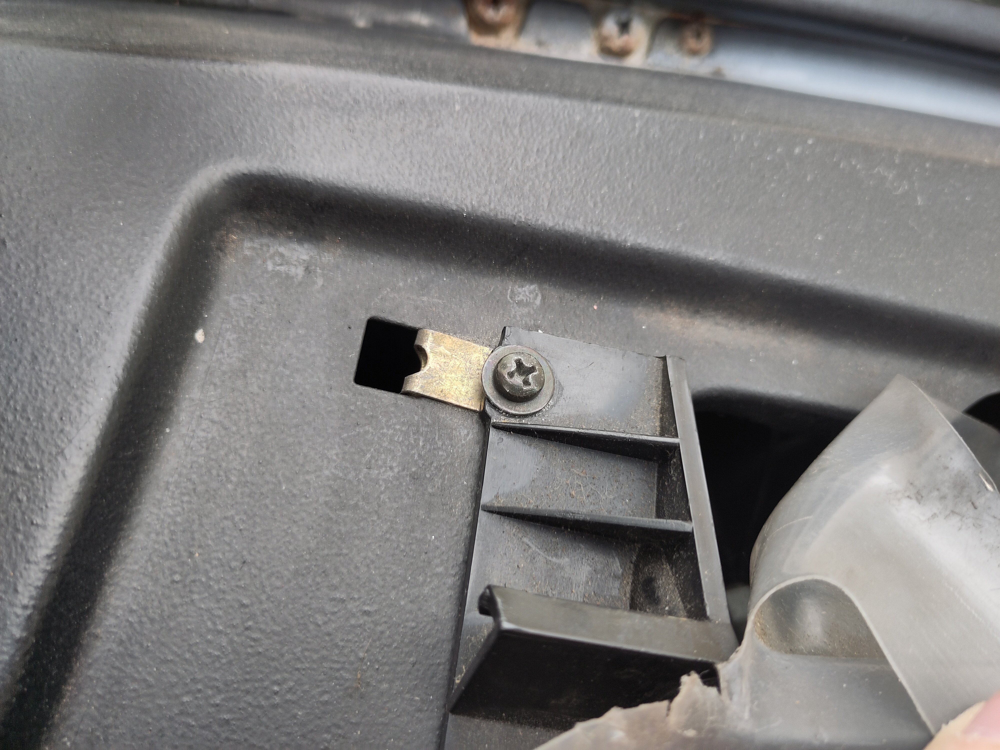
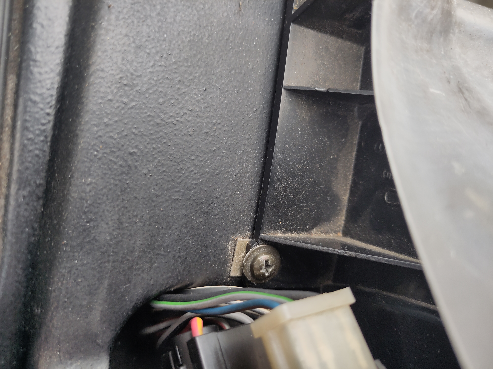
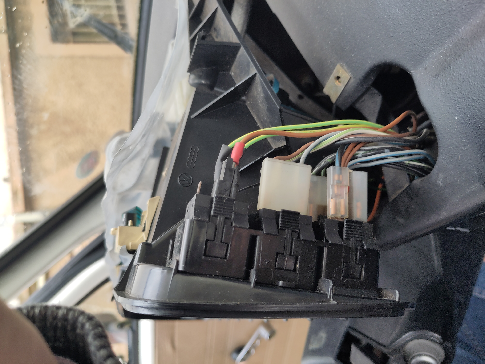
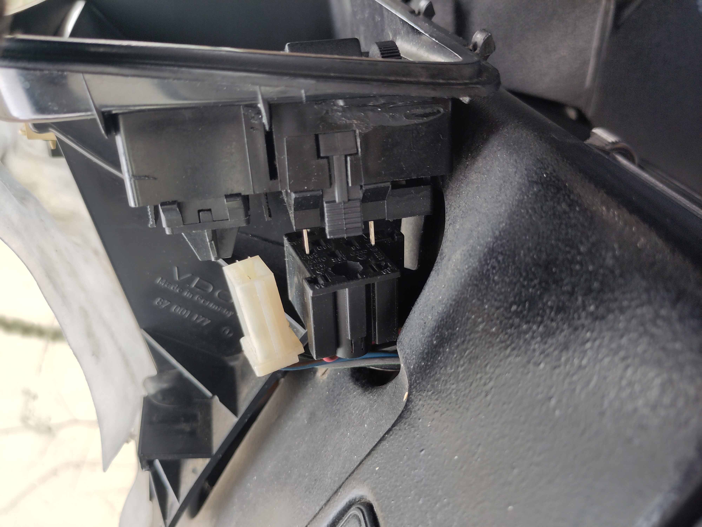
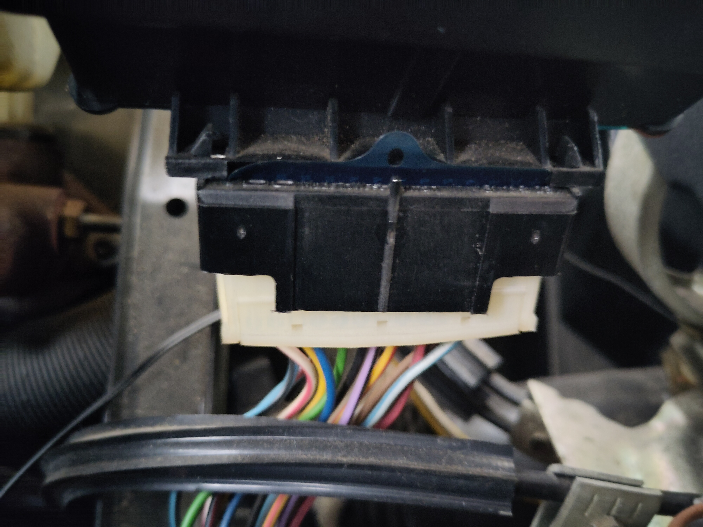
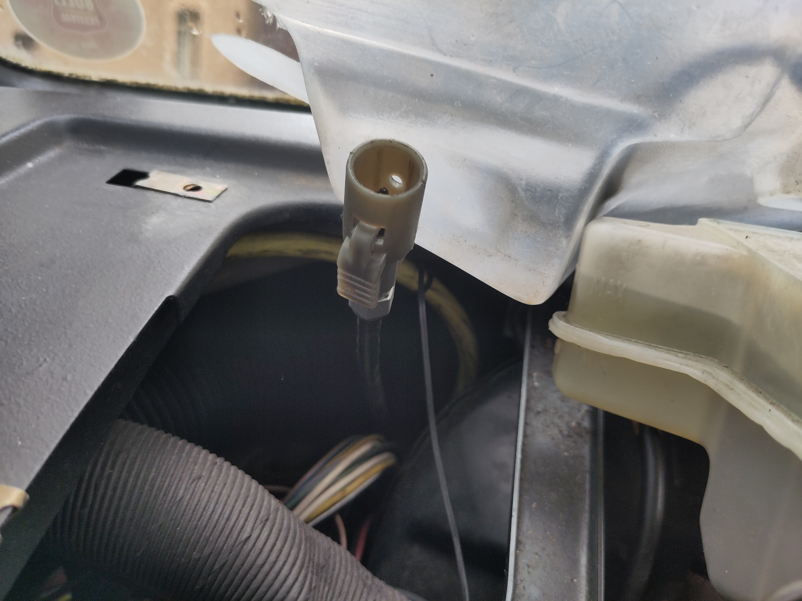
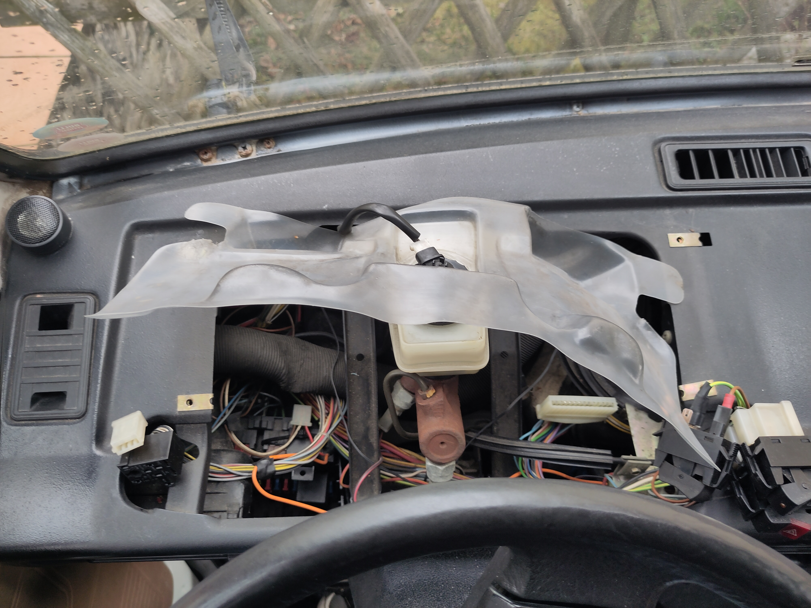
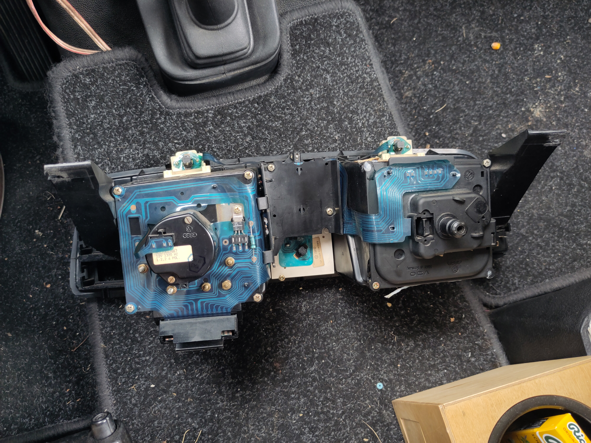

Cockpit Ausbau
==============

* Abdeckung abnehmen
  Dazu hinter die Abdeckung greifen (Richtung Windschutzscheibe)
  und an den Vertiefungen vorsichtig nach oben in Richtung
  Lenkrad ziehen.

* 3 Schrauben loesen (siehe Bild oben: vorne rechts, vorne links, hinten links)
Detail-Bild Schraube vorne rechts:

Detail-Bild Schraube vorne links:

Detail-Bild Schraube hinten links:

* Schalter und Stecker abziehen
Detail-Bild 3x Stecker/Schalter rechts:

Detail-Bild 2x Stecker/Schalter links:

Detail-Bild Steckerleiste unten:

Detail-Bild Tachowelle Stecker:

Draufsicht Amaturenbrett ohne Cockpit:

Rueckansicht ausgebautes Cockpit:

Ausbauen Tacho und oeffnen
--------------------------

* Stecker abziehen
  bild 30
* Problem verrutschte Achse Kilometerzaehler
  bild 33
* Tacho oeffnen
  * Tachonadel ueber 0kmh Stopper heben
  * Ruheposition markieren
    bild XXX
bild 39, geoeffneter Tacho

