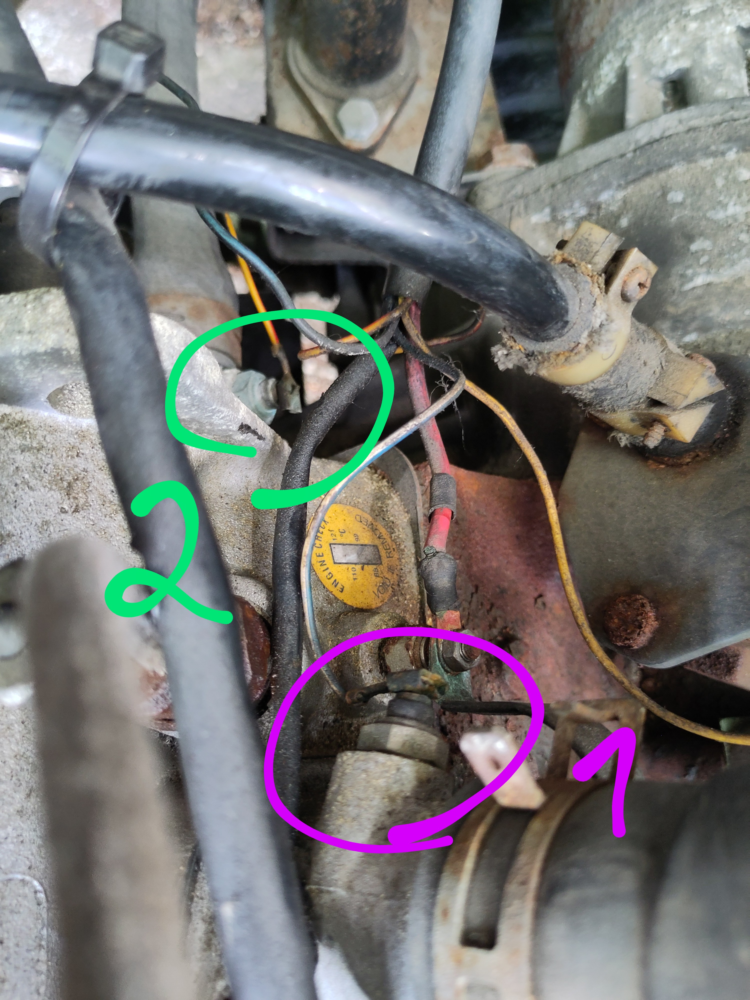
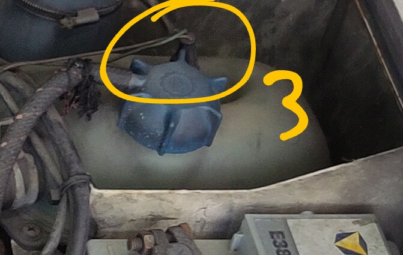

Komponenten-Übersicht
=====================
Im Motor gibt es zwei Temperaturgeber und einen Füllstandsgeber:

1. Temperaturgeber Vorglühanlage
2. Temperaturgeber Kühlmittelanzeige
3. Füllstandsgaber Kühlmittelanzeige

Position [1] (blau-weisses Kabel) und [2] (rot-gelbes Kabel):

Position [3] (Stecker oben auf Ausgleichsbehälter):

Komponenten-Test
================

Vorglüh-Lampe (im Cockpit)
------------------------------------------
Temperaturgeber Vorglühanlage (blau-weisses Kabel)
1. abziehen
  -> Vorglühlampe im Cockpit geht an
2. an Masse halten (Motorblock)
  -> Vorglühlampe im Cockpit wieder aus

Kühlmittel Temperatur-Anzeige (im Cockpit)
------------------------------------------
TODO
